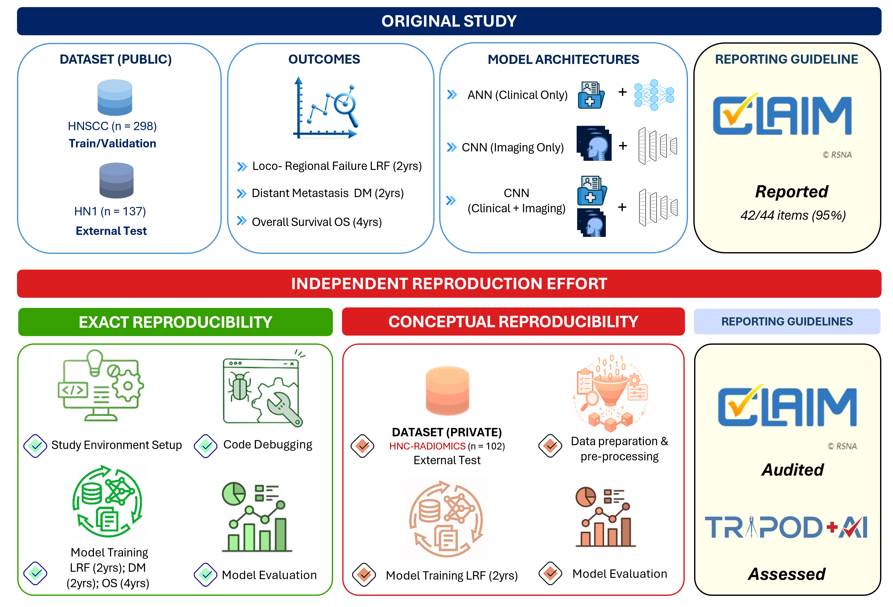

# Independent Reproducibility Assessment of CNN-based Head and Neck Cancer Prognostic Models

[](https://opensource.org/licenses/MIT)
[](https://www.python.org/downloads/)

Independent assessment of reproducibility and external validation of image-based prognosis in head and neck cancer using convolutional neural networks.

## Table of Contents
- [Description](#description)
- [Study Design](#study-design)
- [Key Findings](#key-findings)
- [Requirements](#requirements)
- [Data Pre-processing](#data-pre-processing)
- [Running the Model](#running-the-model)
  - [Data Configuration](#data-configuration)
  - [Model Architectures](#model-architectures)
  - [Validation Strategies](#validation-strategies)
  - [Training Scripts](#training-scripts)
  - [Data Split](#data-split)
  - [Training](#training)
  - [Clinical Data](#clinical-data)
- [Citation](#citation)

---

## Description

This repository contains code and documentation for an **independent reproducibility assessment** of the study by Mateus et al. (2023):
> *"Image based prognosis in head and neck cancer using convolutional neural networks: a case study in reproducibility and optimization"* - Scientific Reports

We performed:
1. **Exact reproduction** - Attempted to replicate original results using provided code, data, and methodology
2. **Conceptual reproduction** - External validation on a geographically distinct cohort (CMC Vellore, India, n=102)
3. **Dual-framework compliance assessment** - Evaluated the original study against CLAIM and TRIPOD+AI reporting guidelines

---

## Study Design



**Figure 1.** Overview of the independent reproduction effort showing exact reproducibility (using original datasets and code), conceptual reproducibility (external validation on CMC cohort), and dual-framework compliance assessment (CLAIM and TRIPOD+AI).

---

## Key Findings

- ✅ **Exact reproduction achieved** - Results comparable to original (AUC differences: –0.22 to +0.10)
- 🐛 **Preprocessing bug discovered** - Slice selection algorithm corrected, improving success rate from 60% to 100%
- ⚠️ **7 barriers encountered** - Required 7 weeks to resolve through author communication and code modifications
- 📊 **External validation** - Performance degradation observed on Indian cohort (AUC 0.54-0.59 vs original 0.71-0.79)
- 📋 **Dual-framework assessment** - CLAIM: 86% vs 95% (self-reported); TRIPOD+AI: 77%

---

## Requirements

### System Requirements
- Ubuntu 24.04 LTS (or similar Linux distribution)
- Python 3.10
- NVIDIA GPU (recommended: Quadro RTX 5000 or equivalent with 16GB RAM)
- FSL (FMRIB Software Library) version 6.0

### Python Dependencies

Install using the provided requirements file:

```bash
pip install -r requirements.txt
```

**Key packages:**
- PyTorch 1.13.1
- NumPy 1.22.0
- Scikit-learn 1.5.0
- Pillow 10.3.0
- nibabel 3.2.1
- dcmrtstruct2nii 1.0.19

---

## Data Pre-processing

We identified and corrected a critical bug in the original preprocessing pipeline. Our corrected pipeline consists of:

1. **DICOM to NIfTI conversion** - Convert CT scans and RT STRUCT using `dcmrtstruct2nii`
2. **Reorientation and masking** - Apply GTV mask to NIfTI using FSL
3. **Corrected slice selection** ⚠️ - Two-pass algorithm focusing on tumor-containing slices
4. **HU windowing** - Apply windowing (-50 to 300 HU) and Gaussian smoothing (σ=0.5)
5. **Cropping and normalization** - Crop to 180×180 pixels, normalize to 0-255

### ⚠️ Critical Fix: Slice Selection Algorithm

**Original bug:** Selected slice by total pixel count, often choosing non-tumor slices with artifacts.

**Our correction:** Two-pass tumor-focused algorithm
```python
# Pass 1: Identify tumor-containing slices
# Pass 2: Select slice with largest tumor area among tumor-containing slices
```

**Impact:** Improved success rate from 60% to 100% across all datasets.

**Scripts:**
- Step 1-2: `scripts/preprocessing/convert_dicom.py`
- Step 3-5: `scripts/preprocessing/windowing_cropping.py` (corrected version)

---

## Running the Model

### Quick Start

```bash
# Clone repository
git clone https://github.com/hash123shaikh/reproducibility-hnc-cnn.git
cd reproducibility-hnc-cnn

# Install dependencies
pip install -r requirements.txt

# Download public datasets
# Canadian: https://doi.org/10.7937/K9/TCIA.2017.8oje5q00
# Dutch: https://doi.org/10.7937/TCIA.2019.8kap372n

# Run preprocessing
python scripts/preprocessing/windowing_cropping.py

# Train model (example: Distant Metastasis with 5-fold CV)
python scripts/training/training_dm.py
```

### Data Configuration

Configure data paths in training scripts:

```python
DATA = {
    TRAIN: {
        CLINICAL_DATA_PATH: "data/canada.csv",
        SCANS_PATH: "data/pre-processed/canada/",
    },
    VALIDATION: {
        CLINICAL_DATA_PATH: "data/canada.csv",
        SCANS_PATH: "data/pre-processed/canada/",
    },
    TESTING: {
        CLINICAL_DATA_PATH: "data/maastro.csv",
        SCANS_PATH: "data/pre-processed/maastro/",   
    }
}
```

### Model Architectures

Three model types are available:

1. **ANN (Clinical Only)** - Artificial Neural Network using only clinical variables
   - Input: 11 clinical features (T-stage, N-stage, tumor volume - one-hot encoded)
   - Architecture: 4 fully connected layers

2. **CNN (Imaging Only)** - Convolutional Neural Network using only CT images
   - Input: 180×180 pixel cropped CT images
   - Architecture: 3 convolutional blocks + 4 fully connected layers

3. **CNN + Clinical** - Combined model using both imaging and clinical data
   - Input: CT images + 11 clinical features
   - Architecture: CNN feature extraction + clinical data fusion

### Validation Strategies

**Cohort Split Approach:**
- Training: 2 Canadian centers (HGJ, CHUS)
- Validation: 2 Canadian centers (HMR, CHUM)
- External Test: Dutch dataset (MAASTRO)

**5-Fold Cross-Validation:**
- Stratified k-fold on full Canadian dataset
- External Test: Dutch dataset (MAASTRO)

### Training Scripts

Training scripts follow this naming convention:
- `training_{outcome}.py` = 5-fold cross-validation, **imaging only**
- `training_{outcome}_cd.py` = Cohort split, **imaging + clinical data**

where `{outcome}` is:
- `dm` - Distant Metastasis (2-year)
- `lrf` - Locoregional Failure (2-year)  
- `os` - Overall Survival (4-year)

**Examples:**

```bash
# Distant Metastasis
python scripts/training/training_dm.py       # imaging only
python scripts/training/training_dm_cd.py    # imaging + clinical

# Locoregional Failure
python scripts/training/training_lrf.py      # imaging only
python scripts/training/training_lrf_cd.py   # imaging + clinical

# Overall Survival
python scripts/training/training_os.py       # imaging only
python scripts/training/training_os_cd.py    # imaging + clinical
```

**Training time:** ~17-19 hours per outcome (5-fold CV), ~7GB peak memory usage

---

### Data Split

In this work, we followed the same data split as previous studies. In this strategy, two cohorts are used for training, two for validation, and one exclusively for external validation. To train the model following this method, configure the `DATA_SPLIT` parameter with `COHORT_SPLIT`.

The cohort for training and validation are part of the [Head-Neck-PET-CT dataset](https://doi.org/10.7937/K9/TCIA.2017.8oje5q00).

The dataset [HEAD-NECK-RADIOMICS-HN1](https://doi.org/10.7937/tcia.2019.8kap372n) from Maastro was used exclusively for external validation.

Additionally, we evaluated the uncertainty of the model with a 5-fold cross validation strategy. To train the model following this method, configure the `DATA_SPLIT` parameter with `CROSS_VALIDATION`.

### Training

The current implementation allows to train and evaluate 3 different models:
- A convolutional neural network (set the `Model` parameter in the configuration to `CNN`)
- An artificial neural network (set the `Model` parameter in the configuration to `ANN`)
- A logistic regression (set the `Model` parameter in the configuration to `LR`)

These models can be evaluated by splitting the data following the `COHORT_SPLIT` or cross validation (check previous section).

The additional parameters available are described below:
- `FOLDS`: Number of folds to use when performing cross validation
- `TIME_TO_EVENT`: The minimum observation period for a non-event to be included in the training
- `EVENT`: Event that the network will predict (`DM` - Distant Metastasis, `LRF` - Local-Regional Failure, `OS` - Survival)
- `HYPERPARAMETERS`: Set of hyperparameters to change from the default ones (check below)
- `BATCH_SIZE`: the batch size
- `LOGS_PATH`: Path to store the logs and metrics
- `CLINICAL_VARIABLES`: State the clinical variables that will be included when training the model
- `DATA_AUGMENTATION`: Data augmentation techniques to apply

Regarding the hyperparameters employed:
- `LEARNING_RATE`: the learning rate (default: 0.05)
- `EPOCHS`: number of epochs
- `MOMENTUM`: momentum
- `DAMPENING`: dampening (default: 0.00)
- `RELU_SLOPE`: slope for the RELU function (default: 0.10)
- `WEIGHTS_DECAY`: weight decay (L2 penalty) (default: 0.0001)
- `OPTIMIZER`: optimizer used, default: SGD - https://pytorch.org/docs/stable/generated/torch.optim.SGD.html
- `CLASS_WEIGHTS`: weights for each class in the loss function (default: [0.7, 3.7])

Regarding the data augmentation techniques:
- `HORIZONTAL_FLIP`: by default a probability of 0.5
- `VERTICAL_FLIP`: by default a probability of 0.5
- `ROTATE_90`: randomly rotate the image 90 degrees 1-3 times, by default a probability of 0.75
- `ROTATION`: randomly rotate the image a certain number of degrees, by default maximum 10 degrees

To store the model, include the following parameters:
- `MODEL_ID`: will be used for the file name in combination with the epoch number
- `MODEL_PATH`: the path for the folder to store the models
- `THRESHOLD`: (optional) Stores the model if the AUC for the validation set is above this value
- `MAX_DIFFERENCE`: (optional) Stores the model if the difference between the training and validation AUC is below this value

### Clinical Data

The clinical variables currently considered can be checked in the file `hn_cnn/parse_data.py`.
The dictionary `CLINICAL_DATA` identifies the necessary variables and the values used across the different datasets.
This information is used to harmonize the datasets before training the network.

The clinical information considered: primary site, T-stage, N-stage, TNM-stage, HPV (human papillomavirus) status, volume, and area of the tumour.

Currently, the clinical variables included in the model (when setting `CLINICAL_VARIABLES` to `True`) are pre-set in the file `hn_cnn/parse_data.py`:
```python
features = tabular[["n0", "n1", "n2", "t1", "t2", "t3", "t4", "vol0", "vol1", "vol2", "vol3"]]
``` 

If you change this set, make sure to also modify the number of neurons in the network accordingly (file `hn_cnn/cnn.py`).

---

## Reproducibility

The training scripts allow setting up the necessary seeds to make results fully reproducible:
- Random seed for Python (`random.seed()`)
- Random seed for data split, necessary when performing cross-validation (`StratifiedKFold`)
- Random seed for PyTorch library (`torch.manual_seed()`)

When reproducing the results from our manuscript, seeds are provided in `data/seeds.xlsx`. Include the following in your training script:

```python
import random
import torch

random.seed(seed_value)  # From seeds.xlsx
random_seed_split = random.randint(0, 9174937)
torch.manual_seed(seed_value)  # From seeds.xlsx
```

The scripts in `scripts/training/` already include all necessary configurations to reproduce our results for each outcome.

### Hardware-Dependent Numerical Variations

We trained our models on **Ubuntu 24.04 LTS** with **NVIDIA Quadro RTX 5000 GPUs** at Christian Medical College, Vellore. Although we provide seeds and scripts for reproduction, inconsistencies may occur on different hardware architectures.

We observed that some systems produce different results when executing the `torch.nn.Dropout` function, even with identical seeds. From experiments across different machines, we believe this is caused by CPU architecture differences:

```python
import random
import torch

random.seed(7651962)
random_seed_split = random.randint(0, 9174937)
torch.manual_seed(775135)

# Consistent across architectures:
data = torch.randn(4, 4)

# Architecture-dependent results:
dp1 = torch.nn.Dropout(p=0.3)
dp1(data)

# x86-64 architecture (our system):
# tensor([[-1.0361, -0.0000, -0.0000,  1.8477],
#         [-2.0117, -1.2687, -0.0785,  0.0000],
#         [-0.0000, -2.3690, -0.0955, -0.0000],
#         [-0.4844,  1.5011,  1.8367,  2.3154]])

# vs ARM architecture:
# tensor([[-1.0361, -3.5810, -1.1379,  1.8477],
#         [-0.0000, -1.2687, -0.0000,  1.7217],
#         [-1.4952, -2.3690, -0.0955, -0.0000],
#         [-0.4844,  1.5011,  1.8367,  2.3154]])
```

Setting the following configurations did **not** resolve the architecture-dependent behavior:

```python
device = torch.device("cpu")
torch.backends.cudnn.deterministic = True
torch.set_num_threads(1)
```

**Alternative:** To avoid this issue entirely, you can implement a deterministic dropout:

```python
x = torch.ones(10, 20)
p = 0.5
mask = torch.distributions.Bernoulli(probs=(1-p)).sample(x.size())
x[~mask.bool()] = x.mean()
out = x * mask * 1/(1-p)
```

### Datasets Used

**Original Study (Exact Reproduction):**
- Training set: [HGJ and CHUS](https://doi.org/10.7937/K9/TCIA.2017.8oje5q00) - Canadian Head-Neck-PET-CT dataset
- Validation set: [HMR and CHUM](https://doi.org/10.7937/K9/TCIA.2017.8oje5q00) - Canadian Head-Neck-PET-CT dataset
- External test set: [MAASTRO](https://doi.org/10.7937/tcia.2019.8kap372n) - Dutch HEAD-NECK-RADIOMICS-HN1 dataset

**Conceptual Reproducibility (Our External Validation):**
- External validation set: CMC Vellore, India (n=102) - Private dataset, access restricted

---

## Citation

If you use this code or findings in your research, please cite:

```bibtex
[Our paper citation - to be added after publication]
```

**And the original study:**

```bibtex
@article{mateus2023image,
  title={Image based prognosis in head and neck cancer using convolutional neural networks: a case study in reproducibility and optimization},
  author={Mateus, Pedro and Volmer, Leroy and Wee, Leonard and Aerts, Hugo JWL and Hoebers, Frank and Dekker, Andre and Bermejo, Inigo},
  journal={Scientific Reports},
  volume={13},
  number={1},
  pages={18176},
  year={2023},
  publisher={Nature Publishing Group UK London},
  doi={10.1038/s41598-023-45486-5}
}
```

---

## Acknowledgments

- **Original study authors** (Mateus et al.) for sharing code and providing clarifications during reproduction
- **The Cancer Imaging Archive (TCIA)** for providing public datasets
- **Christian Medical College Vellore** for computational resources and clinical data

---

## License

This project is licensed under the MIT License - see [LICENSE](LICENSE) file for details.

---

## Contact

- **Hasan Shaikh** - [GitHub](https://github.com/hash123shaikh)
- **Dr. Hannah Mary Thomas T** - hannah.thomas@cmcvellore.ac.in
- **Institution:** Quantitative Imaging Research and AI Lab, Christian Medical College, Vellore, India

---

**Note:** This is a reproducibility study. For the original implementation, see the [original repository](https://github.com/MaastrichtU-CDS/hn_cnn).
